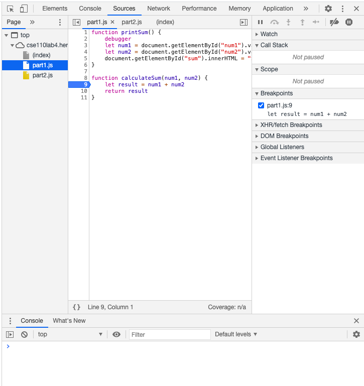
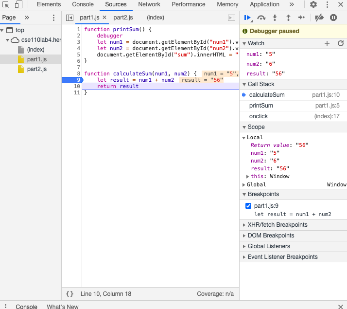
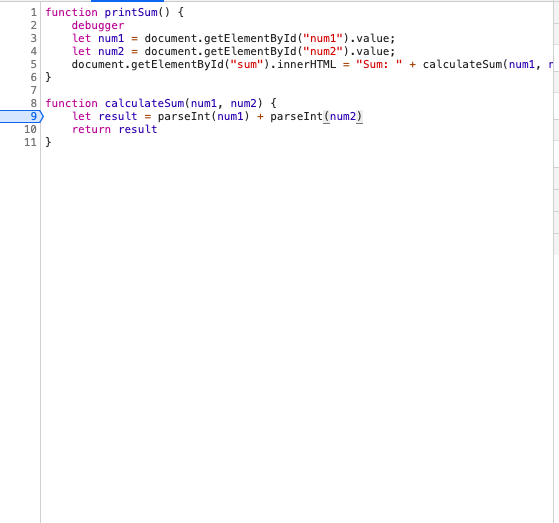

## Part 3. Debugging using the DevTools  
### DevTools - Debugging
 
 
- num1 = "5"
- num2 = "6"
- result = "56" 
(they are all string data types)

- What was the bug?
  - The bug was that is was concatenating num1 and num2 insetead of adding them as intergers
- How would you fix it? Include a screenshot of your fix.
  - I would parse the strings of num1 and num2 into integers first before adding them to get the correct result. 

1. What is the name of the new json file?  
   1. citylots.json  
2. Which file initiated the download of the new file?  
   1. part2.js:2  
3. What is its file size?  
   1. 11.7 MB	
4. How long did it take to download?  
   1. 3.44 s						
5.  What was your User-Agent for the browser that made the request?
    1.  Mozilla/5.0 (Macintosh; Intel Mac OS X 10_15_7) AppleWebKit/537.36 (KHTML, like Gecko) Chrome/87.0.4280.141 Safari/537.36  
6.  In the response, what type of server did it come from?
    1.  Apache  
7.  When was the file last modified?
    1.  Tue, 26 Jan 2021 22:14:13 GMT  
8.  What was the Content-Type of the file?
    1.  application/json  
9.  Which method inside the initiating file made the request?
    1.  fetchData()

